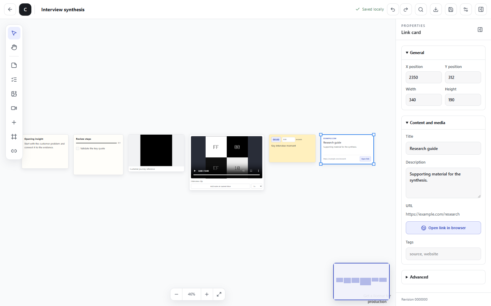

# CanvasNote

CanvasNote is a local-first Electron desktop application for arranging notes, media, files, links, and timestamped video research on an infinite canvas.

> **Development status:** version 0.1.0 is under active UI/UX and quality work. There is no signed public installer or production-ready release yet.



This screenshot was captured from an isolated local workspace in the real Electron application. The matching before/after review is stored under [`docs/design`](docs/design).

## Features

- Local workspaces with recent boards, favourites, templates, Trash, and full-text search.
- A tldraw infinite canvas with notes, checklists, images, files, links, local video, approved YouTube/Vimeo embeds, timestamp notes, frames, and connections.
- Grouping, locking, duplication, properties editing, undo/redo, minimap navigation, context actions, and clipboard or drag-and-drop image import.
- Debounced autosave, manual save, rotating backups, save-before-close flushing, revision conflict detection, and missing-media repair.
- Portable, readable `.canvasnote` JSON with workspace-relative media paths.
- `.canvasnote` import plus JSON, PNG, and PDF export through native dialogs.
- Light, dark, and system appearance settings using semantic design tokens and reduced-motion support.

## Video timestamp workflow

1. Import a local video with `Shift+V`, or add an approved YouTube/Vimeo embed.
2. Play or seek to the relevant moment, then pause.
3. Use **Add note at current time** on the video or in Properties. This pauses the video.
4. Edit the timestamp note on the canvas.
5. Select the timestamp note to focus and seek its linked video. Seeking keeps the video paused until Play is pressed.

The workflow does not autoplay media. Codec support for local video still depends on Electron and the operating system.

[Watch the 11-second timestamp workflow](docs/screenshots/timestamp-workflow.mp4).

## Screenshots

Curated captures use deterministic repository-local test data and are stored at:

- [Welcome](docs/screenshots/welcome.png)
- [Dashboard](docs/screenshots/dashboard.png)
- [Board editor](docs/screenshots/board-editor.png)
- [Video timestamp workflow](docs/screenshots/video-timestamp.png)
- [Search](docs/screenshots/search.png)
- [Dark settings](docs/screenshots/settings-dark.png)

The real application output and its visual-regression baselines were manually reviewed before being committed.

## Local-first storage and security

CanvasNote has no account, telemetry service, cloud sync, or collaboration backend. Core board, index, media, export, and backup data stays inside a workspace selected by the user. Opening an external link or using an approved YouTube/Vimeo embed can contact that external provider.

The renderer is sandboxed with context isolation enabled and Node integration disabled. A narrow preload bridge exposes validated domain operations, while filesystem and SQLite authority remains in the Electron main process. Workspace paths are checked for traversal and symlink escapes, and local media is served through a scoped custom protocol instead of `file://` URLs.

See [SECURITY.md](SECURITY.md) for the threat boundaries and current vulnerability-reporting status.

## Requirements

- Node.js 22.12 or newer; Node.js 24 LTS is recommended.
- npm 11 or newer.
- Git for a source checkout.

Development and CI are configured for Windows, macOS, and Linux builds. Current packaging configuration produces a Windows NSIS installer; macOS and Linux distribution, signing, and release support are not yet validated.

Dependency lifecycle scripts are disabled in `.npmrc`. The explicit setup step downloads Electron when needed and verifies the shipped `better-sqlite3` N-API binary, so the normal setup does not require Python or a local C++ compiler.

## Installation from source

```bash
git clone https://github.com/Richy-coder171/For-me-.git
cd For-me-
npm ci
npm run setup
npm run dev
```

`npm run dev` also runs the setup check through its `predev` script.

### Windows blank-window troubleshooting

Some terminals can inherit `ELECTRON_RUN_AS_NODE=1`, which makes Electron start as Node instead of opening the renderer. Clear it in the same PowerShell window, then start CanvasNote:

```powershell
Remove-Item Env:ELECTRON_RUN_AS_NODE -ErrorAction SilentlyContinue
npm run dev
```

## Development commands

| Command                | Purpose                                                  |
| ---------------------- | -------------------------------------------------------- |
| `npm run setup`        | Download Electron when absent and verify SQLite.         |
| `npm run dev`          | Start the Electron development application.              |
| `npm run preview`      | Preview the production bundles in Electron.              |
| `npm run typecheck`    | Run strict TypeScript checking.                          |
| `npm run lint`         | Run ESLint.                                              |
| `npm run lint:fix`     | Apply safe ESLint fixes.                                 |
| `npm test`             | Run the Vitest suite once.                               |
| `npm run test:watch`   | Run Vitest in watch mode.                                |
| `npm run test:e2e`     | Set up, build, and run all Playwright Electron checks.   |
| `npm run test:a11y`    | Run automated WCAG A/AA checks on critical screens.      |
| `npm run test:visual`  | Compare reviewed Windows visual-regression baselines.    |
| `npm run format`       | Format tracked source and documentation with Prettier.   |
| `npm run format:check` | Check formatting without modifying files.                |
| `npm run build`        | Build production main, preload, and renderer bundles.    |
| `npm run check`        | Run typecheck, lint, unit tests, and a production build. |

## Packaging

```bash
npm run package
```

This runs setup and the production build before Electron Builder. The current configuration creates a Windows NSIS package under `release/`; that directory is ignored by Git. Locally produced packages are unsigned unless the repository owner configures a trusted signing identity.

Development runs without a tldraw production key and shows the tldraw licensing watermark. Do not hide or remove that watermark. Distributing CanvasNote with tldraw requires an appropriate [tldraw licence](https://tldraw.dev/community/license) and a valid `VITE_TLDRAW_LICENSE_KEY`; CanvasNote's MIT licence does not replace tldraw's terms.

## Workspace format

A selected workspace contains its board-owned data:

```text
Workspace/
|-- workspace.json
|-- .canvasnote/index.sqlite3
|-- boards/
|-- trash/boards/
|-- media/
|   |-- images/
|   |-- videos/
|   |-- audio/
|   `-- files/
|-- thumbnails/
|-- exports/
`-- backups/
```

Versioned `.canvasnote` files are the portable board source of truth. Media is copied into the workspace and referenced through normalized relative paths; large blobs and absolute machine paths are not stored in board JSON. SQLite is a rebuildable metadata and search index, not the board-content authority.

Small device preferences and approved recent-workspace references live in Electron's application-data directory; board content and imported media do not.

See [FILE_FORMAT.md](FILE_FORMAT.md) for the version 1 schema and compatibility rules.

## Keyboard shortcuts

Shortcuts are ignored while an editable field or native media control has focus.

| Shortcut           | Action                                      |
| ------------------ | ------------------------------------------- |
| `V` / `H`          | Select / pan tool                           |
| `N`                | Add note                                    |
| `C`                | Add checklist                               |
| `I`                | Import image                                |
| `Shift+V`          | Import local video                          |
| `F`                | Add frame                                   |
| `L`                | Add connection                              |
| `Ctrl/Cmd+K`       | Search objects and run application commands |
| `Ctrl/Cmd+S`       | Save immediately                            |
| `Ctrl/Cmd+Z`       | Undo                                        |
| `Ctrl/Cmd+Shift+Z` | Redo                                        |
| `Ctrl/Cmd+D`       | Duplicate selection                         |
| `Ctrl/Cmd+G`       | Group selection                             |
| `0`                | Zoom to fit                                 |
| `1`                | Reset zoom                                  |

## Documentation

- [Architecture](ARCHITECTURE.md)
- [File format](FILE_FORMAT.md)
- [Security policy](SECURITY.md)
- [UI/UX audit](UI_UX_AUDIT.md)
- [Design system](docs/design/DESIGN_SYSTEM.md)
- [Design changelog](docs/design/DESIGN_CHANGELOG.md)
- [Usability checklist](docs/design/USABILITY_CHECKLIST.md)
- [Development plan](DEVELOPMENT_PLAN.md)
- [Changelog](CHANGELOG.md)
- [Contributing](CONTRIBUTING.md)
- [Code of Conduct](CODE_OF_CONDUCT.md)

## Project status

CanvasNote 0.1.0 has working local workspace, canvas, media, timestamp, search, persistence, and export workflows. The UI/UX redesign now includes reviewed after screenshots, automated accessibility checks, and Windows visual-regression baselines. Release signing and broader distribution validation are still pending, so treat the repository as development software rather than a production-ready release.

## Contributing

Read [CONTRIBUTING.md](CONTRIBUTING.md) before changing persistence, Electron security boundaries, accessibility behavior, or visual baselines. Never commit personal workspaces, board contents, media, logs, secrets, build output, or installers.

## Licence

CanvasNote source is available under the [MIT Licence](LICENSE). Third-party packages retain their own licences. In particular, production use and distribution of tldraw must comply with tldraw's separate licensing terms.
